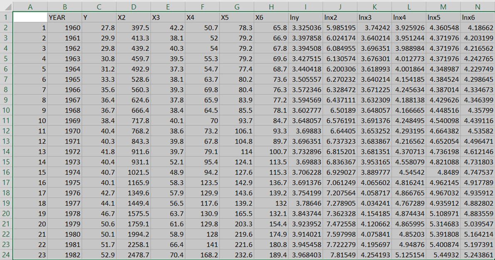

```{r knitr_init, echo=FALSE, cache=FALSE}
library(knitr)
library(rmarkdown)
library(rmdformats)

## Global options
options(max.print="100")
opts_chunk$set(echo=TRUE,
	             cache=TRUE,
               prompt=FALSE,
               tidy=TRUE,
               comment=NA,
               message=FALSE,
               warning=FALSE)
opts_knit$set(width=100)
```


Licença {-#Licença}
===================

This work is licensed under the Creative Commons Attribution-ShareAlike 4.0 International License. To view a copy of this license, visit <http://creativecommons.org/licenses/by-sa/4.0/> or send a letter to Creative Commons, PO Box 1866, Mountain View, CA 94042, USA.

{ width=25% }

Citação {-#Citação}
===================================

Sugestão de citação:
FIGUEIREDO, Adriano Marcos Rodrigues. Econometria: copy and paste do Excel para RStudio. Campo Grande-MS,Brasil: RStudio/Rpubs, 2020. Disponível em <http://rpubs.com/amrofi/copy_paste> e <https://adrianofigueiredo.netlify.app/post/copy-paste/>. 

Script para reprodução (se utilizar, citar como acima)
==================

```{r echo=FALSE}
# a single file
xfun::embed_file('2020-08-18-econometria-copy-and-paste-do-excel-para-rstudio.pt.Rmd')
```

Introdução
===================


Este material é um pequeno auxílio para trazer os dados do MS Excel para o RStudio fazendo copiar (control+C) e colar (control+V).
    
O exemplo parte da ideia de Souza (2015).

Procedimentos
===================

A lógica do procedimento é colocar os dados na _clipboard_ e depois puxar para o RStudio.

1.    Abra sua planilha em MS Excel contendo os dados organizados;    
2.    Abra o RStudio no projeto de trabalho e abra um script;    
3.    No MS Excel, copie (control+C) nos dados com rótulos; 



4.    No script do RStudio, cole o código abaixo e execute após o 'copiar' do MS Excel:

```{r, eval=FALSE}
dados <- read.table('clipboard',
                   sep='', 
                   header=TRUE, 
                   dec=',', 
                   row.names=1)
```
    
Ao rodar o script, o RStudio entenderá que deve pegar os dados do _clipboard_ e colocar no objeto `dados`. A opção `sep` indica que os dados estão separados por tabulação (default do Excel); a opção `header=TRUE` indica que o rótulo das colunas deve ser mantido; a opção `dec=','` indica que os decimais estão separados por vírgula (_comma separated values_); a opção `row.names=1` indica a coluna identificadora na planilha original. Como no presente caso não se tem coluna identificadora, deixa-se sem essa opção e ele numerará sequencialmente os dados. No caso, como a célula A1 está vazia, o RStudio entende que esta é a coluna identificadora. Portanto, executou-se abaixo:    

Portanto, deve-se ter os dados no objeto dados e sua visualização é feita pela função `View` ou no presente caso, `print`. A função `type.convert` instrui a conversão das colunas de dados de `character` para `double` (ou seja, numérico)

```{r}
dados <- read.table('clipboard',
                   sep='', 
                   header=TRUE, 
                   dec=',')
dados.convert<-type.convert(dados)
print(dados.convert[,1:7])
```

```{r}
summary(dados.convert)
```

Referências {-#Referências}
========================

SOUZA, R.O. Copiando planilhas RStudio. RStudio, 2015. Disponível em: <https://rpubs.com/ROGRO/69256>. Acesso em 18.Ago.2020.